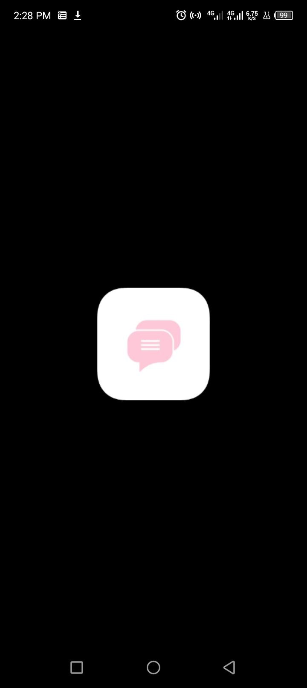
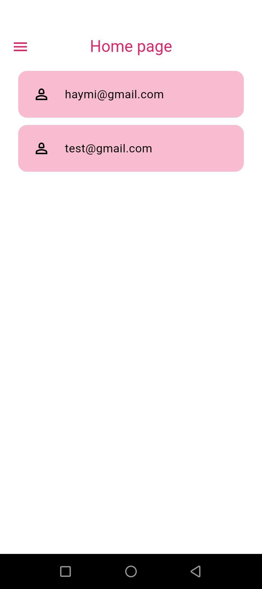
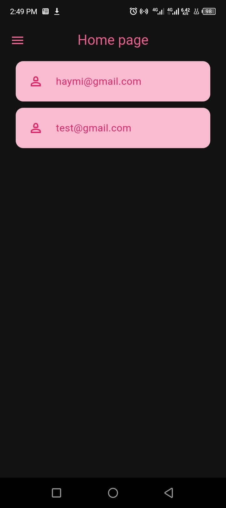
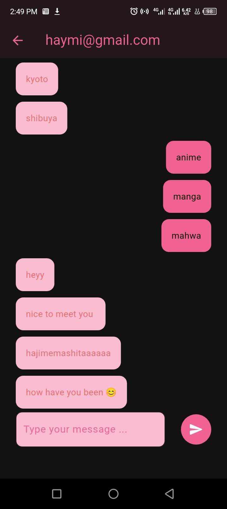
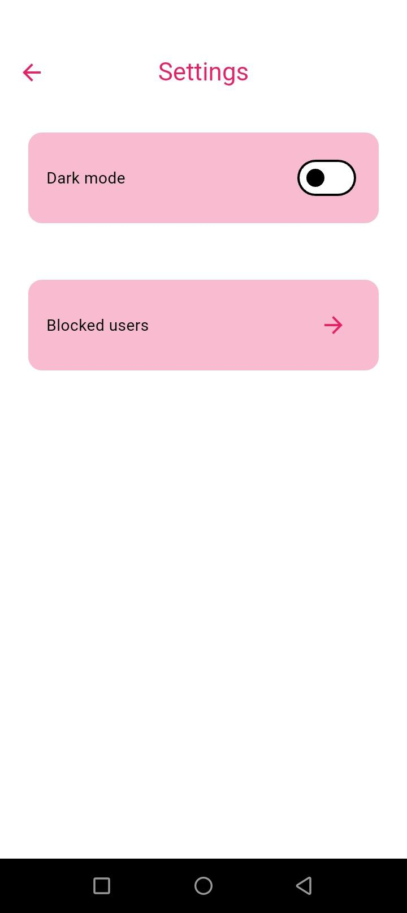

# 💬 Flutter Firebase Chat App

  

A **real-time chat application** built with **Flutter** and **Firebase**.  
This was my **first project using Firebase as a backend**, and it was both challenging and rewarding! The app includes authentication, real-time messaging, blocking users, and a clean, responsive UI.

---

## 🎯 Features

- **Authentication**
  - Email & password sign-up and login
  - User authentication via Firebase Auth

- **Real-time Chat**
  - Send and receive messages instantly
  - Messages stored in Firebase Firestore
  - Auto-scroll to latest messages

- **User Management**
  - View all registered users excluding blocked ones
  - Block and unblock users in real-time

- **UI/UX**
  - Light & dark theme support
  - Clean and responsive chat interface
  - Custom chat bubbles for sent and received messages

- **Extra Functionality**
  - Report inappropriate messages
  - Drawer for app navigation
  - Focus handling for message input

---

## 🛠 Skills & Technologies

- **Frontend:** _Flutter, Dart_
- **Backend:** _Firebase Authentication, Firebase Firestore_
- **State Management:** _Provider_
- **Tools:** _VS Code, Git & GitHub_

---

## 💻 Installation

1. **Clone the repository**
```bash
git clone <your-repo-url>
cd chat_app
```
2. **Install dependencies**
```bash
flutter pub get
```
3. **Set up Firebase**
Follow the FlutterFire documentation to configure Firebase for Android and iOS.
Replace firebase_options.dart with your Firebase project options.

4. **Run the App**
   ```bash
   flutter run
    ```
5. 📸 **Screenshots**














6. 🎥 **Demo**
   
    Check out the demo video         https://www.loom.com/share/74470c699b5f409798e5287363f6fccc

7. 📂** Project Structure**

   ```bash
   lib/
   ├── pages/          # Screens like HomePage, ChatPage, BlockedUsersPage
   ├── services/       # Firebase services: AuthService, ChatService
   ├── widgets/        # Reusable widgets: UserTile, ChatBubble
   ├── themes/         # Theme provider & light/dark themes
   └── main.dart       # Entry point
    ```


